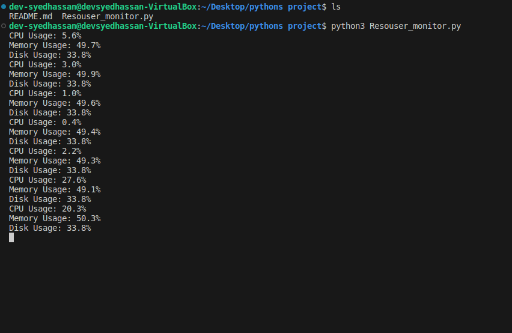

# System Resource Monitor

## Description
This Python script monitors CPU, memory, and disk usage of the system at regular intervals.

## Prerequisites
Before running the script, ensure you have the following prerequisites installed:
- Python 3
- psutil library (`pip install psutil`)

## Usage
1. Clone the repository or download the script file:
You can clone the repository using the following command:

git clone https://github.com/hassanhah/Resource-Monitor-Python-App.git

Alternatively, you can download the script file directly from the repository.

2. Install the required dependencies:
Before running the script, you need to install the psutil module. You can install it using pip, the Python package manager. Open your terminal or command prompt and run the following command:

pip install psutil

3. Run the script:
Once you have cloned the repository and installed the dependencies, navigate to the directory containing the script (system_monitor.py). 
Run the script using the following command:

python system_monitor.py

Script execution:
The script will continuously monitor CPU, memory, and disk usage of the system and print the results to the console.

## Author
- **Syed Hassan Ali**

## Date
- April 18, 2024

